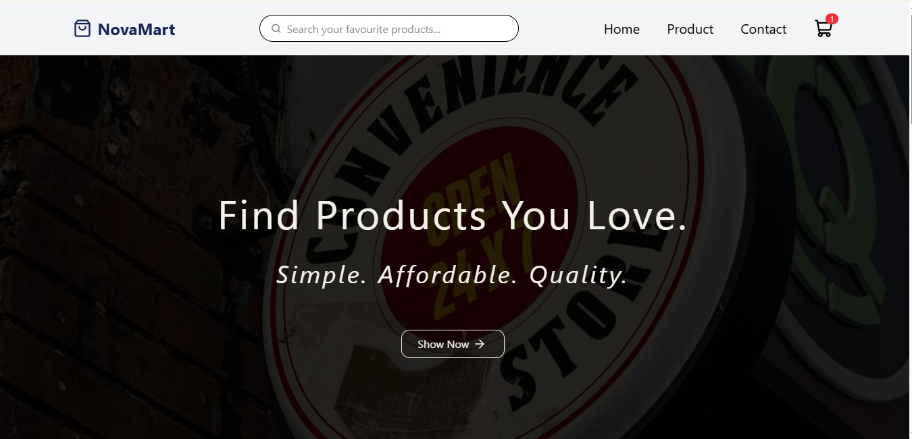

# NovaMart 🛍️

NovaMart is a modern, responsive e-commerce web application built with **React, JavaScript, and Tailwind CSS**. The project demonstrates my ability to design and develop a real-world frontend application with reusable components, responsive layouts, client-side navigation, and interactive shopping cart functionality.

The application focuses on delivering a clean and user-friendly shopping experience across mobile, tablet, and desktop devices. It also serves as a foundation for a larger full-stack e-commerce platform, with plans to integrate a backend, database, authentication, payments, and order management in future development.

## 🚀 Live Demo

[View Live Demo](Will be live soon!!!)

## 📸 Preview



## ✨ Features

- 🏠 Modern and responsive homepage
- 🛍️ Product listing and browsing
- 🔍 Product discovery
- 🛒 Shopping cart functionality
- ➕ Increase product quantity
- ➖ Decrease product quantity
- 🗑️ Remove products from cart
- 💰 Automatic cart total calculation
- 📱 Responsive navigation
- 📄 Contact page
- 📱 Fully responsive design

## 🛠️ Technologies Used

- **React** – Component-based UI development
- **JavaScript** – Application logic and interactivity
- **Tailwind CSS** – Responsive styling and UI design
- **React Router** – Client-side routing and navigation
- **Vite** – Development environment and build tool

## 📂 Project Structure

```text
src/
├── assets/
├── components/
├── pages/
├── context/
├── data/
├── layout/
├── App.jsx
├── main.jsx
└── index.css
```

## ⚙️ Getting Started

### Prerequisites

Make sure you have the following installed:

- Node.js
- npm
- Git

### 1. Clone the Repository

```bash
git clone https://github.com/femight05/NovaMart.git
```

### 2. Navigate to the Project

```bash
cd NovaMart
```

### 3. Install Dependencies

```bash
npm install
```

### 4. Start the Development Server

```bash
npm run dev
```

Open the local development URL provided by Vite in your browser.

## 💡 What This Project Demonstrates

NovaMart demonstrates my practical experience with modern frontend development and my ability to turn an idea into a functional web application.

Through this project, I worked with:

- Reusable React components
- React props and state
- `useState` for application state management
- Event handling
- Conditional rendering
- Dynamic list rendering
- Client-side routing with React Router
- Shopping cart state management
- Reusable UI patterns
- Responsive web design
- Mobile-first development
- Git and GitHub workflow

## 📱 Responsive Design

NovaMart is designed to provide a consistent and accessible experience across different screen sizes.

The application supports:

- 📱 Mobile devices
- 📲 Tablets
- 💻 Laptops
- 🖥️ Desktop screens

## 🔮 Future Development

NovaMart is currently a frontend-focused e-commerce application, but development will continue toward a complete **full-stack e-commerce platform**.

### Backend Integration

I plan to add a backend very soon to introduce features such as:

- 🔐 User authentication and authorization
- 🗄️ Database integration
- 📦 Product management
- 🛒 Persistent shopping carts
- 🧾 Order management
- 👤 User accounts and profiles
- 💳 Checkout and payment processing
- 📊 Order and product management
- 🔌 REST API integration

This will allow NovaMart to move beyond a frontend demonstration and become a fully functional e-commerce application.

## 👨‍💻 Author

**Oluwafemi Akinpelu**

Computer Science Student | Software Developer

- GitHub: [@femight05](https://github.com/femight05)
- X: [@yourusername](https://x.com/AkinpeluFemi5)

## 📄 License

This project was created as part of my frontend development portfolio and is intended for learning and demonstration purposes.
